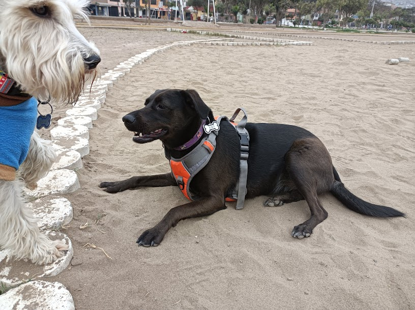

# Kira's API

Kira is my pet 🐕

## Docs

### `/`

> https://kira.deno.dev

You will get a random image of Kira.

### `/docs`

> https://kira.deno.dev/docs

You will be redirected to this page.

### `/:id`

> https://kira.deno.dev/13

You will get an specific Image of Kira.

### `/statistics`

https://kira.deno.dev/statistics

You will get a list with all the images available. (JSON)

## Thanks to

- [Deno Land Inc](https://deno.com/company): Their amazing Deno Deploy free tier
  and their super easy to undestand
  [examples](https://examples.deno.land/http-server-routing).

- My dad [(@eliasbobadilla)](https://github.com/eliasbobadilla): For allowing me
  having a dog.

## License

MIT
